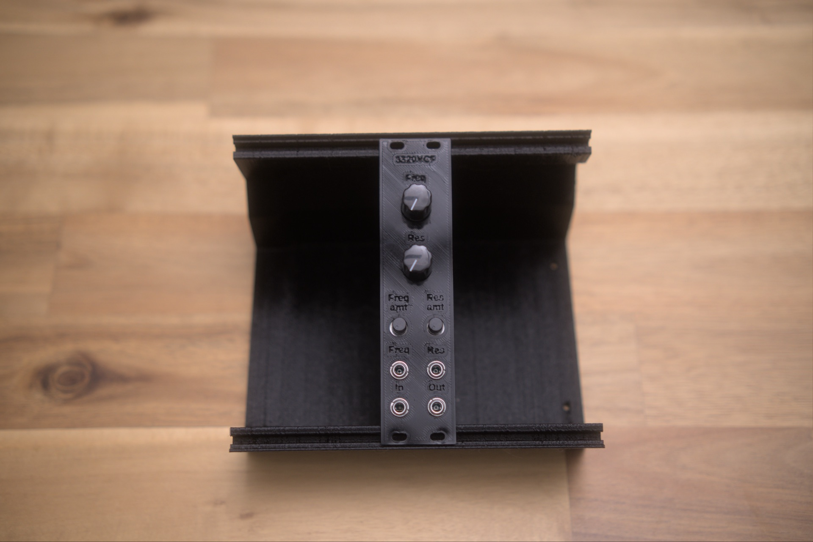

# Eurorack-3320-VCF



A Eurorack 4-pole low-pass voltage-controlled filter based on the [AS3320](https://electricdruid.net/product/as3320-vcf/) chip from Electric Druid — a high-performance 4-pole VCF (CEM3372 family). 12-octave cutoff sweep range and voltage-controlled resonance from zero to oscillation.

## Features

- **4-pole (24 dB/oct) low-pass response** using all four AS3320 filter stages
- **12-octave cutoff range** with smooth exponential control
- **Voltage-controlled resonance** — from zero to self-oscillation
- **Cutoff frequency** controlled by a panel pot + CV input with attenuation
- **Resonance** controlled by a panel pot + CV input with attenuation
- **Three calibration trims**:
  - Freq CV gain trim (RV2)
  - Reso CV gain trim (RV5)
  - Output amplitude trim (RV1)
- Eurorack ±12V power via either 16-pin IDC or 3-pin JST connector
- "Sequential Pro One"-style output buffer with AC coupling
- Audio inputs handle 10 Vpp directly (no input AC coupling needed)

## Inputs and outputs

| Jack | Range | Notes |
|---|---|---|
| Sig In | 10 Vpp | Through 100K input buffer, then to filter chain via 91K |
| Freq CV | 10 Vpp | Mixed with front-panel Freq Control via summing amp |
| Res CV | 10 Vpp | Mixed with front-panel Reso Control via summing amp |
| Sig Out | ≤9 Vpp | AC-coupled, gain-2 output buffer with amplitude trim |

## Block diagram

```
Sig In ─► [TL072 input buffer, U1A] ─► [91K] ─► AS3320 IN1
                                                  │
                                                  ▼ Stage 1 (LP)
                                                IN2 ─► Stage 2 (LP) ─► IN3 ─► Stage 3 (LP) ─► IN4 ─► Stage 4 (LP) ─► Out4
                                                                                                                       │
                                                                                                                       ▼
                                                                                                              [2.2 µF AC couple]
                                                                                                                       │
                                                                                                                       ▼
                                                                                                       [TL072 gain-2 + amp trim] ─► Sig Out
                                                                                                                       │
                                                                                                                       └─► [3.3K] ─► AS3320 Vres (resonance feedback)

Freq Control pot ─► [100K] ─┬─► [TL074 summing amp + RV2 gain trim] ─► AS3320 VCFI (pin 12)
Freq CV jack (RV4 atten) ──►┘

Reso Control pot ─► [100K] ─┬─► [TL074 stage 1 + RV5 gain trim] ─► [TL074 stage 2, 100K/150K] ─► [3.3K] ─► AS3320 Ires (pin 9)
Reso CV jack (RV7 atten) ──►┘

Power: Eurorack ±12V ─► local +12V (filtered) and −12V (filtered)
       AS3320 VEE: −12V via REE (R22 = 1.2K) → internal −2.7V regulator
       AS3320 VCC: +12V direct
       Filter stage Rb resistors (R12/R13/R14): 220K to −12V (note: 240K recommended for +12V VCC per datasheet)
       Filter timing caps (C3–C6): 270 pF each (cap1–cap4 pins)
```

## Power

- Eurorack ±12V via **J5** (3-pin JST) or **J6** (16-pin IDC) — populate one
- D1 / D2: reverse-polarity protection
- C9 / C12 (22 µF): bulk rail decoupling
- C10 / C11 (100 nF): op-amp supply decoupling
- **R22 = 1.2 kΩ — AS3320 VEE current limit resistor.** *Required* — the chip has an internal −2.7V regulator and must not see more than ~8 mA on the VEE pin.

REE formula from datasheet: **REE = (|VEE| − 2.7) / 0.008**

| VEE supply | REE |
|---|---|
| −10V | 910 Ω |
| −12V | 1.2 kΩ ← *used here* |
| −15V | 1.5 kΩ |

## Calibration

Three trim pots. Adjust in order, with the module warmed up ~5 minutes.

**RV1 — Output amplitude trim.** Sets final output level. The chip's max output is roughly VCC − 3V (so ~9 Vpp at +12V). Trim until output reaches 10 Vpp at modest input + maximum resonance.

**RV2 — Freq CV gain trim.** Sets the gain of the Freq CV path. Tune to taste — full range of the Freq CV jack should produce a musically-useful filter sweep.

**RV5 — Reso CV gain trim.** Sets the gain of the Reso CV path. At maximum reso CV, filter should reach self-oscillation; at minimum, no resonance.

Procedure:
1. With the module warmed up, set Freq Control to mid, Reso Control to min, no inputs patched.
2. Patch a steady audio signal (sawtooth from a VCO, ~−10 dB) into Sig In and a scope on Sig Out.
3. Adjust RV1 until peak output is ~10 Vpp without clipping.
4. Sweep Freq Control by hand; should hear the filter open and close smoothly.
5. Raise Reso Control — should hear the resonant peak grow, eventually self-oscillating at high values.
6. With a 0–5V LFO patched into Reso CV (jack pot RV7 fully open), adjust RV5 to get the same self-oscillation behavior when CV-driven as you got from the panel pot.
7. With a 0–5V LFO patched into Freq CV (jack pot RV4 fully open), adjust RV2 to get a similar full-range sweep when CV-driven.

## Design references

- [AS3320 datasheet](https://alfatriode.lv/eng/sc/AS3320.pdf) — definitive reference for the chip
- [Electric Druid AS3320 product page](https://electricdruid.net/product/as3320-vcf/)
- [Electric Druid multimode filter notes](https://electricdruid.net/multimode-filters-part-1-reconfigurable-filters/) — the AS3320 can be wired for LPF / HPF / BPF / APF; this design is LPF only
- Output buffer topology adapted from the Sequential Pro One synth
- [Falstad simulations](falstad/) of input, frequency control, resonance control, and output sub-circuits

## Build status

What's ready for builders today, and what's still on the TODO list:

**Production assets**

- [x] Schematic — Rev 0.1.5 ([PDF](Schematic%20PDFs/3320-VCF_Schematic-Rev-0.1.5.pdf))
- [ ] PCB layout — rev 0.1.0 separated for fab in `kicad/Separate boards/rev0.1.0/`; schematic has advanced to 0.1.5, **re-separation pending**
- [ ] Gerber files for fabrication — none yet
- [ ] BOM — none yet
- [ ] Final front panel (SVG/PDF for fab) — none yet
- [ ] License — none yet

**Prototype assets**

- [x] 3D-printed prototype panel STL — [3320_VCF.stl](3D%20Printed%20Panel/3320_VCF.stl)
- [x] Falstad simulations — [falstad/](falstad/)

**Documentation**

- [x] Photos of the assembled module — see [photos/](photos/)
- [ ] Demo video — none yet
- [ ] Build / assembly instructions — none yet
- [x] Calibration / tuning notes — see "Calibration" section above

Want to help fill a gap (build photos, gerbers, an assembly guide)? Open an issue or PR.
